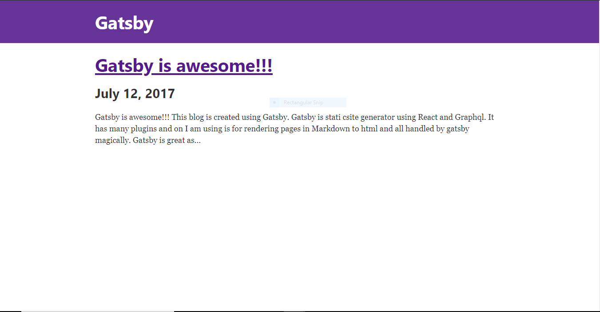

<figcaption>First Blog</figcaption>

This blog is created using Gatsby. Gatsby is static site generator using React and Graphql. It has
many plugins and on I am using is for rendering pages in Markdown to html and all handled by gatsby
magically.

Gatsby is great as it provides many other featurs like taking content from different sources like
Netlify, Contenetful etc with many many starter packs availible.

Lorem ipsum dolor sit amet, consectetur adipiscing elit. Morbi pellentesque pulvinar ipsum quis tempus. In vitae venenatis ipsum, nec lacinia justo. Mauris erat metus, aliquam eget metus non, euismod feugiat ligula. Pellentesque non quam sed purus porta pellentesque eget vitae diam. Cras vestibulum accumsan ipsum, quis bibendum quam commodo non. Praesent commodo tempor ante sit amet feugiat. Cras porttitor sodales consequat. Nulla dictum ex eu facilisis porta. Pellentesque ut viverra nunc. Sed at nunc ornare, euismod arcu nec, aliquam diam.

Integer ac ex tristique, venenatis eros sed, semper quam. Aenean vitae nibh eget neque hendrerit ultrices a ac nisl. Ut pulvinar, nunc eget mollis sodales, lorem tortor eleifend lorem, ac malesuada elit turpis a nulla. In porta lacus sed arcu vulputate aliquet. Quisque ac dictum lectus. Sed consectetur nec sapien non finibus. Donec posuere, leo at congue cursus, dolor erat tristique eros, ut vestibulum felis metus vitae arcu. Nullam augue purus, sodales volutpat elit ac, vehicula vehicula quam.

Etiam tincidunt mattis ligula, et mollis nunc. Integer lobortis eleifend ullamcorper. Etiam blandit ipsum a egestas maximus. Cras sit amet facilisis odio. Quisque tempus accumsan pretium. Proin hendrerit, augue at dapibus mollis, leo justo aliquam erat, id suscipit enim lorem vitae justo. Nullam eleifend gravida ex, quis rutrum arcu efficitur nec. Pellentesque accumsan, eros accumsan vulputate fringilla, magna ex ultricies nisi, vitae imperdiet nisl arcu at nisi. Quisque in nibh feugiat neque laoreet rutrum. In in elit orci. Ut velit nulla, vehicula ac tellus id, elementum suscipit mi. Vivamus eleifend erat sed velit feugiat, et consequat nisl placerat. Mauris fringilla ipsum id nisi lobortis facilisis. Ut bibendum elit ante, nec dignissim velit iaculis hendrerit. Vivamus congue nunc eu nisi congue pellentesque. Nunc venenatis molestie nisi.